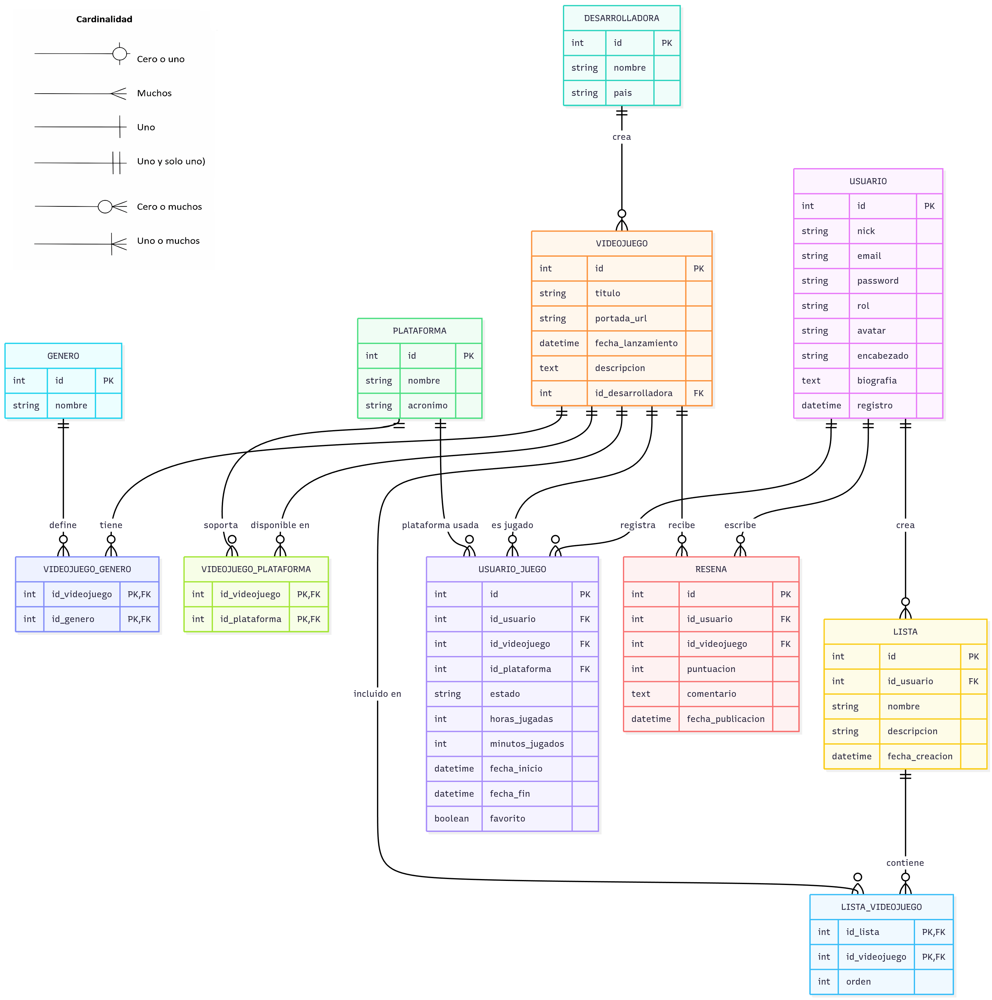

# Arquitectura

## Diseño de datos

El sistema utiliza una base de datos relacional diseñada para mantener la integridad de la información mientras permite flexibilidad en las interacciones del usuario.

Se han priorizado las siguientes decisiones de diseño:

- **Tablas independientes:** Las entidades `USUARIO`, `DESARROLLADORA`, `GENERO` y `PLATAFORMA` no dependen de otras.
- **Relaciones N:M:** Se utilizan tablas intermedias para vincular juegos con géneros y plataformas, así como para gestionar la biblioteca del usuario.
- **Tipos de datos:** Se usa `VARCHAR` en lugar de `ENUM` para facilitar futuras expansiones sin alterar la estructura de la tabla.

## Creación de la base de datos

<details markdown="1">
  <summary>Despliegua para ver el código SQL para la generación de la estructura en MySQL/MariaDB.</summary>

```sql
CREATE DATABASE IF NOT EXISTS LogNow;
USE LogNow;

CREATE TABLE USUARIO (
    id INT AUTO_INCREMENT PRIMARY KEY,
    nick VARCHAR(50) NOT NULL UNIQUE,
    email VARCHAR(100) NOT NULL UNIQUE,
    password VARCHAR(255) NOT NULL,
    rol VARCHAR(20) DEFAULT 'usuario',
    avatar VARCHAR(255),
    encabezado VARCHAR(255),
    biografia TEXT,
    registro DATETIME DEFAULT CURRENT_TIMESTAMP
);

CREATE TABLE DESARROLLADORA (
    id INT AUTO_INCREMENT PRIMARY KEY,
    nombre VARCHAR(100) NOT NULL,
    pais VARCHAR(50)
);

CREATE TABLE GENERO (
    id INT AUTO_INCREMENT PRIMARY KEY,
    nombre VARCHAR(50) NOT NULL UNIQUE
);

CREATE TABLE PLATAFORMA (
    id INT AUTO_INCREMENT PRIMARY KEY,
    nombre VARCHAR(100) NOT NULL,
    acronimo VARCHAR(20)
);

CREATE TABLE VIDEOJUEGO (
    id INT AUTO_INCREMENT PRIMARY KEY,
    titulo VARCHAR(150) NOT NULL,
    portada_url VARCHAR(255),
    fecha_lanzamiento DATETIME,
    descripcion TEXT,
    id_desarrolladora INT,
    FOREIGN KEY (id_desarrolladora) REFERENCES DESARROLLADORA(id) ON DELETE SET NULL
);

CREATE TABLE LISTA (
    id INT AUTO_INCREMENT PRIMARY KEY,
    id_usuario INT NOT NULL,
    nombre VARCHAR(100) NOT NULL,
    descripcion VARCHAR(255),
    fecha_creacion DATETIME DEFAULT CURRENT_TIMESTAMP,
    FOREIGN KEY (id_usuario) REFERENCES USUARIO(id) ON DELETE CASCADE
);

CREATE TABLE VIDEOJUEGO_GENERO (
    id_videojuego INT NOT NULL,
    id_genero INT NOT NULL,
    PRIMARY KEY (id_videojuego, id_genero),
    FOREIGN KEY (id_videojuego) REFERENCES VIDEOJUEGO(id) ON DELETE CASCADE,
    FOREIGN KEY (id_genero) REFERENCES GENERO(id) ON DELETE CASCADE
);

CREATE TABLE VIDEOJUEGO_PLATAFORMA (
    id_videojuego INT NOT NULL,
    id_plataforma INT NOT NULL,
    PRIMARY KEY (id_videojuego, id_plataforma),
    FOREIGN KEY (id_videojuego) REFERENCES VIDEOJUEGO(id) ON DELETE CASCADE,
    FOREIGN KEY (id_plataforma) REFERENCES PLATAFORMA(id) ON DELETE CASCADE
);

CREATE TABLE USUARIO_JUEGO (
    id INT AUTO_INCREMENT PRIMARY KEY,
    id_usuario INT NOT NULL,
    id_videojuego INT NOT NULL,
    id_plataforma INT NOT NULL,
    estado VARCHAR(50) NOT NULL, -- 'jugando', 'completado', 'abandonado', etc.,
    horas_jugadas INT DEFAULT 0,
    minutos_jugados INT DEFAULT 0,
    fecha_inicio DATETIME,
    fecha_fin DATETIME,
    favorito BOOLEAN DEFAULT FALSE,
    FOREIGN KEY (id_usuario) REFERENCES USUARIO(id) ON DELETE CASCADE,
    FOREIGN KEY (id_videojuego) REFERENCES VIDEOJUEGO(id) ON DELETE CASCADE,
    FOREIGN KEY (id_plataforma) REFERENCES PLATAFORMA(id) ON DELETE CASCADE
);

CREATE TABLE RESENA (
    id INT AUTO_INCREMENT PRIMARY KEY,
    id_usuario INT NOT NULL,
    id_videojuego INT NOT NULL,
    puntuacion INT CHECK (puntuacion BETWEEN 0 AND 100),
    comentario TEXT,
    fecha_publicacion DATETIME DEFAULT CURRENT_TIMESTAMP,
    FOREIGN KEY (id_usuario) REFERENCES USUARIO(id) ON DELETE CASCADE,
    FOREIGN KEY (id_videojuego) REFERENCES VIDEOJUEGO(id) ON DELETE CASCADE
);

CREATE TABLE LISTA_VIDEOJUEGO (
    id_lista INT NOT NULL,
    id_videojuego INT NOT NULL,
    orden INT DEFAULT 0,
    PRIMARY KEY (id_lista, id_videojuego),
    FOREIGN KEY (id_lista) REFERENCES LISTA(id) ON DELETE CASCADE,
    FOREIGN KEY (id_videojuego) REFERENCES VIDEOJUEGO(id) ON DELETE CASCADE
);
```

</details>

## Diagrama entidad-relación


