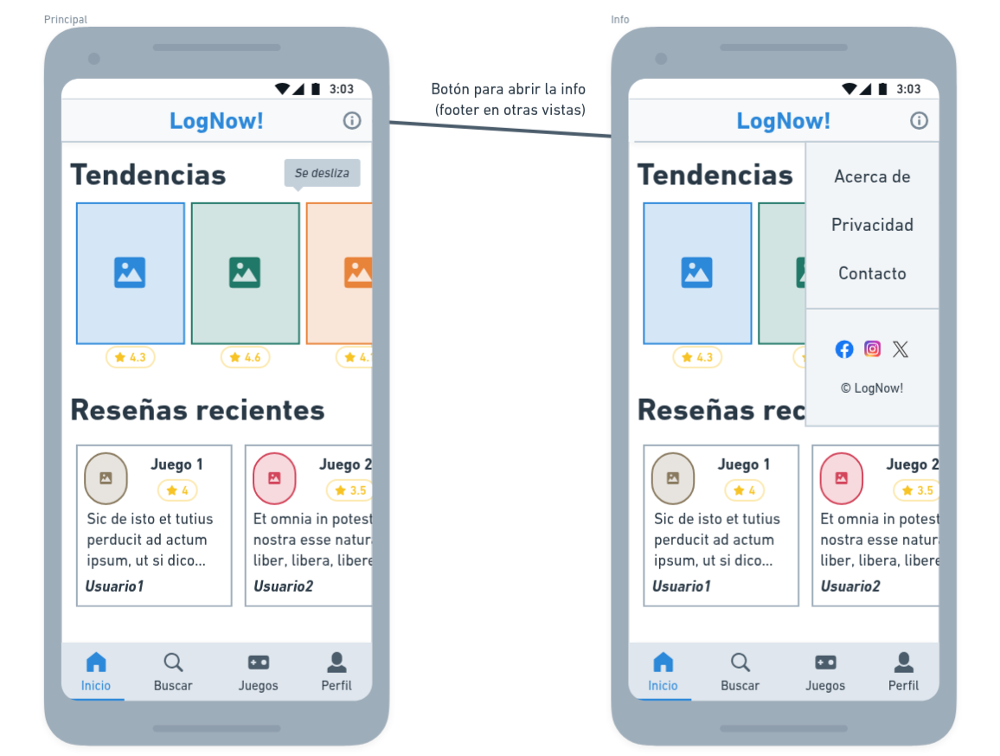
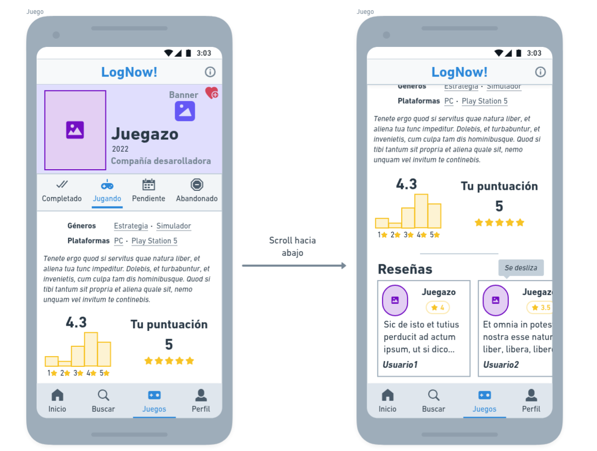

# Manual de uso

## Capturas

### 1. Página principal

Punto de entrada donde se visualizan las tendencias y la actividad reciente de la comunidad.

### 2. Ficha de videojuego

Vista de detalle con la información técnica traída de la API y el resumen de la interacción del usuario (estado y nota media).

### 3. Registro de actividad

Formulario donde el usuario gestiona su progreso, escribe reseñas y clasifica el juego.

## Casos de uso

### 1. Registrar seguimiento (Backlog)

- **Actor:** Usuario registrado.
- **Objetivo:** Indicar que se posee o se está jugando a un juego.
- **Flujo:**
  1.  El usuario accede a la ficha de un juego (ej. "Juego 2023").
  2.  Pulsa el botón de acción (+) para abrir el formulario de registrar juego.
  3.  Selecciona el estado principal (_Completado, Jugando, Pendiente, Abandonado_).
  4.  Indica la plataforma (ej. _Nintendo Switch_) y el tiempo jugado.
  5.  Guarda los cambios pulsando "Completar".

### 2. Valorar y reseñar

- **Actor:** Usuario registrado.
- **Objetivo:** Puntuar y opinar sobre un juego.
- **Flujo:**
  1.  Dentro del mismo formulario de registro, el usuario asigna una puntuación (estrellas).
  2.  Redacta su opinión en el campo de texto inferior.
  3.  Al guardar, la reseña se publica en el feed de la comunidad y se vincula a su perfil.

### 3. Organización avanzada (Opcional)

- **Actor:** Usuario registrado.
- **Objetivo:** Clasificación específica.
- **Flujo:**
  - **Favoritos:** El usuario pulsa el icono de corazón para destacar el juego en su perfil.
  - **Listas:** Pulsando el botón "+ Añadir a lista", el usuario puede incluir el juego en colecciones personalizadas (ej. "RPGs favoritos").

## Usuarios tipo

Se han definido tres perfiles de usuario con permisos diferenciados:

### Usuario no registrado (Invitado)

Perfil pasivo que visita la web para consultar información.

- **Permisos:** Búsqueda en el catálogo, lectura de fichas técnicas y visualización de reseñas públicas.
- **Limitaciones:** No puede abrir el formulario de registro ni interactuar.

### Usuario registrado

El perfil principal de la aplicación.

- **Permisos:** Acceso al formulario de registro para gestionar su biblioteca, publicar reseñas, puntuar y crear listas.

### Administrador

Perfil técnico encargado del mantenimiento.

- **Permisos:** Acceso total al sistema, moderación de reseñas reportadas y gestión de usuarios.

## Tabla de permisos

| Funcionalidad       | Invitado | Usuario Registrado | Administrador |
| :------------------ | :------: | :----------------: | :-----------: |
| Buscar juegos       |    ✅    |         ✅         |      ✅       |
| Ver reseñas         |    ✅    |         ✅         |      ✅       |
| Gestionar Backlog   |    ❌    |         ✅         |      ✅       |
| Escribir reseñas    |    ❌    |         ✅         |      ❌       |
| Puntuar juegos      |    ❌    |         ✅         |      ❌       |
| Crear listas        |    ❌    |         ✅         |      ✅       |
| Moderar contenido   |    ❌    |         ❌         |      ✅       |
| Gestión de usuarios |    ❌    |         ❌         |      ✅       |
